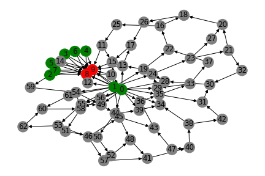
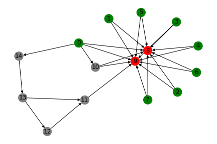
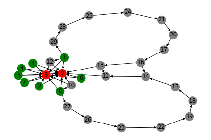
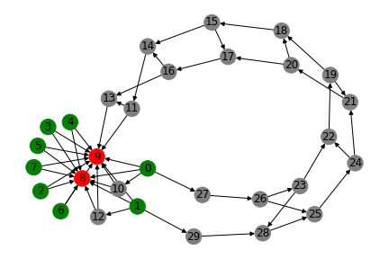

Project last updated June 21, 2021. README last updated March 1, 2025.

## Introduction

This project generates neural network architectures through a cell-based, bottom-up approach. Instructions are given to individual neurons on how to connect to each other and produce new neurons. Starting from a minimal network structure, more complicated topologies emerge through the distributed, spontaneous developments of individual neurons. The cell-based instructions are gradually optimized through evolutionary algorithm.

To try it yourself, run __Evolution.py__

Dataset.py generates a toy dataset which imitates visual stimulations to two retinas (see discussion on "modularity" below).

## Examples

The neural networks start with basic structures connection input nodes (green) to output nodes (red).
After a few generations, some networks learn to develop hidden layers by connection useful inputs to a couple of intermediary neurons, as shown below. 

The topology of hidden layers are further developed as evolution continues. We begin to see symmetry/modularity when such topologies are beneficial to the task at hand. In our case, the toy dataset simulates binocular vision, and consequently two copies of a similar structures seem to have emerged. 

Finally, a complicated web of neurons developed, showcasing that the algorithm is able to develop advanced modularized neural structures to fit the data.

__To see more example topologies generated by this project, go to the "evolved_topologies" directory.__

## Motivation

There is abundant research on automatic generation of more efficient neural network architectures. One fundamental question for those attempts is how neural architecture should be represented in code.

NAS methods such as NEAT (Neural Evolution of Augmenting Topologies) adopt the "blueprint" approach, in which the object to be optimized is an explicit statement of the nodes and connections in a neural topology.

One notable shortcomings of such approaches is __modularity__. When a successful local topology is produced, it is unclear how we can replicate that local success to other parts where it would also be helpful, without explicitly coding replication of modules.
I take inspiration from the mechanisms behind biological modularity. The human body (and its brain) is created not through a top-down approach, but a bottom-up one. In an embryogenic state (and also after birth), cells interact, change, and split (create new cells) in a localized/distributed manner according to instructions given by genes, and macro structures emerge therefrom.

## Implementation

This project is an attempt to make use of that biological inspiration. In this project, every neural network goes through an embryogenic state where the topology is grown iteratively.
Each neuron takes up a place in a two-dimensional space and interact with a local environment to develop a network topology.

Central to the implementation are genes. A gene specifies an interaction ("operator") with another neuron and the conditions under which this interaction should happen.

### Operator

The operator defines the type of topological change that would occur if the gene is activated. Currently, this is either addConnection or InsertNode

* 0: addConnection - This operator looks for a nearby neuron and grows a connection to it.
* 1: insertNode - This operator inserts a new neuron halfway between an existing connection between two neuron.

These two basic operations (0: addConnection and 1: InsertNode) are inspired by NEAT, and should theoretically allow the construction of any feedforward neural network architecture.

### Selectivity

Genes are not always active. Instead, only a subset of genes are expressed in each type of biological cell. Furthermore, neurons choose to develop a connection to another neuron based on the specific characteristics of the target neuron. For example, in the retina, bipolar cells would connect to ganglion cells.

To simulate this, for each neuron, we would need information to answer the question: _What kind of cell is this?_
In this project, I implement this information by using "historical markings" (frequently referred to as "hm" in code).
The HM of a neuron is the sequence of the gene operators that influenced the neuron.
For example, if a neuron first grew connections with three neurons and then inserted new neurons in two of those connections, then the HM of that node would be "00011".
The intuition here is that the "developmental history" of a cell is a good surrogate for the type of cell it is now. If two cells have similar HM sequences, then they might be similar cells.

A gene specifies two HM sequences, one for the originating node and one for the target node. The operator of a gene will only apply between a pair of neurons if both HM sequences match those specified in the gene:

* own_historical_marking - The developmental path that the neuron should have taken for the gene to be active.

* target_historical_marking - The developmental path that the target neuron should have taken for the gene to be active.

### Spatial Locality

Each neuron looks for nearby neurons with the above attributes to either establish neural connections or insert new neurons. We have a 2D grid of neurons to implement spatial locality.

### The Gene Object

Despite operator, own_HM, and target_HM, a gene also has the following two fields:

* uses_before_expiration - This controls the number of times the gene can be activated in a neuron before it will be permanently disabled by the neuron. This is aimed at prevent the neural topology from growing forever. Each neuron maintains its own counter for a gene, so a gene can be disabled in some neurons but not others.

* new_connection_weight - This specifies the weight of the connection when doing a feed-forward pass, just like any other neural network.

See __log.txt__ for historical developments on the project, concerns, and possible paths for future improvement.

## Future Work

- Optimize neurogenesis runtime --  Currently, there are critical inefficiencies in the algorithm. For example, neighboring area selection, et cetera.  Real biological processes are complex and computationally expensive to simulate.  The principle behind evolutionary algorithms is to find approximate processes that are similarly effective but not so expensive. The gene codes in this project is an example.  Future work includes extending this principle to other parts of the project so that it can scale.
- Looks like some genes would create too much useless nodes. Add constraint to prevent this
- More complicated test cases
